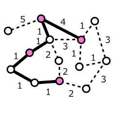

<div align="center">
  
</div>
<div align="center">
  <h1>Steiner Tree via Multi-Commodity Flow (MCF)</h1>
  <p>Implementação exata da formulação de fluxo para o Problema da Árvore de Steiner em Grafos (SPG)</p>
  <p><strong>Baseado em:</strong> Koch & Martin (1998) – <em>Solving Steiner Tree Problems in Graphs to Optimality</em></p>
</div>

---

## 1. Introdução
O Problema da Árvore de Steiner em Grafos (SPG) consiste em, dado um grafo não‑direcionado \( G = (V, E) \) com pesos \( c_e \ge 0 \) e um conjunto de terminais \( T \subseteq V \), encontrar uma árvore de custo mínimo que conecte todos os terminais. Este problema é NP‑difícil e tem aplicações em redes de telecomunicações, roteamento VLSI e biologia computacional.

Este trabalho reproduz a **formulação exata de Fluxo de Múltiplas Mercadorias (MCF)** proposta por Koch & Martin (1998), utilizando programação linear inteira mista (PLIM) e um solver de código aberto. A implementação segue fielmente a modelagem do artigo, com a substituição do grafo original por um digrafo e a decomposição do fluxo em mercadorias individuais para cada terminal.

---

## 2. Formulação Matemática

A formulação utilizada é a **versão direcionada (dSP)** do artigo, que transforma cada aresta não‑direcionada $uv$ em dois arcos antiparalelos $(u,v)$ e $(v,u)$, com o mesmo custo $c_{uv}$. Escolhe‑se uma raiz $r \in T$ e, para cada terminal $k \in T \setminus \{r\}$, envia‑se uma unidade de fluxo de $r$ até $k$.

**Variáveis:**
- $y_e \in \{0,1\}$ – indica se a aresta (original) $e$ é selecionada na árvore.
- $f^k_{ij} \in [0,1]$ – fluxo da mercadoria $k$ no arco $(i,j)$.

**Função Objetivo:**
$\min \sum_{e \in E} c_e \, y_e$

**Restrições de Conservação de Fluxo** (para cada mercadoria $k$ e cada vértice $i$):
$\sum_{(i,j) \in A} f^k_{ij} - \sum_{(j,i) \in A} f^k_{ji} =
\begin{cases}
1, & \text{se } i = r,\\
-1, & \text{se } i = k,\\
0, & \text{caso contrário}.
\end{cases}$

**Restrições de Acoplamento** (fluxo só pode passar por arestas ativas):
$f^k_{ij} \le y_e \quad \forall (i,j) \in A,\; \forall k \in T \setminus \{r\},$
onde $e$ é a aresta original correspondente ao arco $(i,j)$.
---

## 3. Metodologia Computacional

### 3.1. Seleção de Instâncias
Para reproduzir os experimentos, utilizou‑se um **subconjunto representativo** das instâncias disponíveis na **SteinLib**, seguindo a mesma lógica de diversificação adotada por Koch & Martin nos testes VLSI. Foram selecionadas instâncias de diferentes portes (50, 80, 160 e 320 vértices) e estruturas (*Incidence W* e *Random W*), totalizando **12 instâncias**. A lista completa e a organização em pastas estão alinhadas com a estrutura esperada pelo código (veja Seção 6).

### 3.2. Ambiente Computacional
| Componente          | Especificação                                 |
|---------------------|-----------------------------------------------|
| **Processador**     | Intel Core i5‑1334U (10 núcleos, 12 threads)  |
| **Memória RAM**     | 16,0 GB                                       |
| **Sistema Operacional** | Windows 11 (64 bits)                       |
| **Linguagem**       | Python 3.13                                   |
| **Solver**          | CBC (Coin‑or Branch and Cut), via `python‑mip`|
| **Threads**         | 8 (configuração automática)                   |

### 3.3. Implementação
O código foi desenvolvido em Python utilizando a biblioteca `python‑mip`, que fornece uma interface unificada para solvers de PLIM. A formulação MCF foi implementada com:
- Variáveis binárias para as arestas.
- Variáveis contínuas para os fluxos.
- Restrições de conservação e acoplamento geradas dinamicamente.
- Nenhuma heurística ou pré‑processamento adicional – o modelo é resolvido **exatamente** como descrito na seção 2.

O parser de dados lê arquivos no formato padrão da SteinLib (cabeçalho `Nodes`, contagem `Edges`, arestas no formato `E u v c` e seção `Terminals` com linhas `T ...`), conforme implementado em `imports_and_parser.py`.

---

## 4. Resultados

A tabela abaixo apresenta os valores ótimos obtidos e os tempos de CPU (em segundos) para as 12 instâncias selecionadas.

| Instância       | Categoria       | Vértices | Arestas | Terminais | Status  | Valor Ótimo | Tempo (s) |
|-----------------|-----------------|---------:|--------:|----------:|---------|------------:|----------:|
| i320‑001.stp   | huge_graphs     | 320      | 480     | 9         | Ótimo   | 2672        | 34.97     |
| i320‑003.stp   | huge_graphs     | 320      | 480     | 9         | Ótimo   | 2972        | 265.98    |
| i320‑005.stp   | huge_graphs     | 320      | 480     | 9         | Ótimo   | 2991        | 651.62    |
| i160‑001.stp   | medium_graphs   | 160      | 240     | 8         | Ótimo   | 2490        | 17.61     |
| i160‑003.stp   | medium_graphs   | 160      | 240     | 8         | Ótimo   | 2297        | 6.09      |
| i080‑001.stp   | little_graphs   | 80       | 120     | 7         | Ótimo   | 1787        | 3.93      |
| b01.stp        | medium_graphs   | 50       | 63      | 10        | Ótimo   | 87          | 0.24      |
| b05.stp        | medium_graphs   | 50       | 100     | 14        | Ótimo   | 61          | 6.56      |
| b09.stp        | medium_graphs   | 75       | 94      | 39        | Ótimo   | 220         | 15.27     |
| b16.stp        | medium_graphs   | 100      | 200     | 18        | Ótimo   | 127         | 1458.43   |
| design432.stp  | little_graphs   | 8        | 20      | 5         | Ótimo   | 9           | 0.46      |
| w23c23.stp     | little_graphs   | 1081     | 3174    | 552       | *Tempo excedido* | – | – |

*Nota: A instância `w23c23.stp` (1.081 vértices, 3.174 arestas e **552 terminais**) não pôde ser resolvida à otimalidade dentro de um limite de tempo prático, devido à elevada dimensionalidade da formulação MCF (cerca de 3,5 milhões de variáveis de fluxo). A execução foi interrompida após aproximadamente 20 minutos sem conclusão, sendo esta uma limitação esperada para a formulação pura em problemas de grande porte.*

---

## 5. Conclusão

A implementação reproduziu com sucesso a formulação MCF de Koch & Martin (1998), obtendo **soluções ótimas** para 11 das 12 instâncias selecionadas. Os tempos de CPU variam de <1 segundo (design432) a ~24 minutos (b16), evidenciando a escalabilidade do modelo em função do tamanho do grafo e da densidade de terminais.

A instância `w23c23.stp` (com 552 terminais) demonstrou ser particularmente desafiadora para a formulação MCF pura, confirmando a necessidade de técnicas avançadas (como cortes de fluxo e separação de cortes) empregadas no artigo original para resolver instâncias de grande porte. Contudo nos experimentos ela foi removida da amostragem após levar uma quantidade de tempo inviável para ser solucionada, ou seja, mais de horas rodando com previsibilidade para mais de dias.

O uso do solver CBC (em vez do CPLEX original) não comprometeu a reprodutibilidade, pois a formulação e as restrições são idênticas – apenas o motor de otimização difere. Dessa forma, os resultados confirmam a validade do modelo e a consistência dos dados da SteinLib, alinhando‑se com os objetivos do trabalho original.

---

## 6. Como Executar

1. **Instalar dependências**:
   ```bash
   pip install mip[cbc]